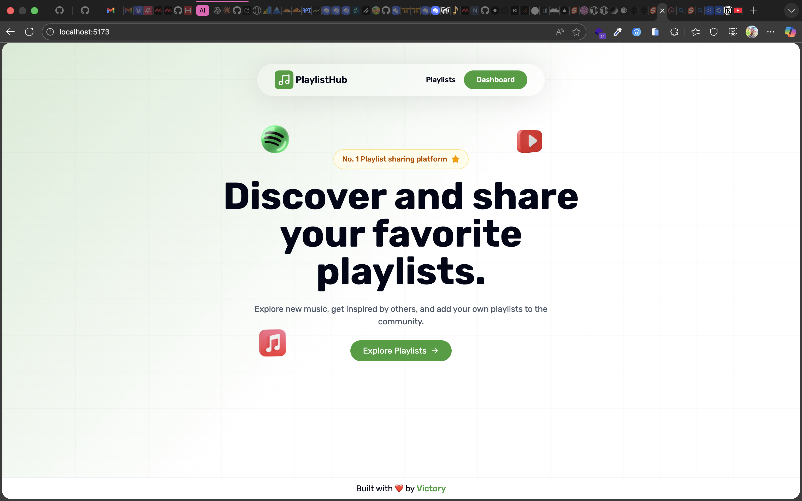
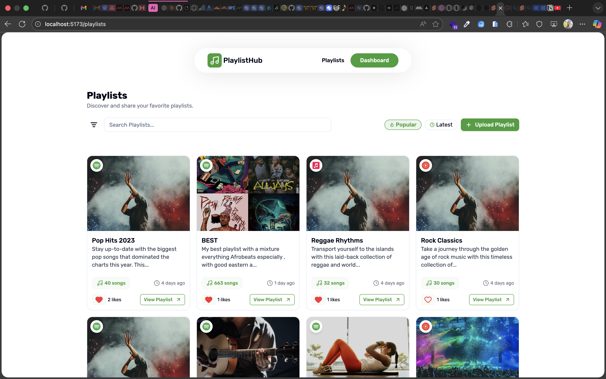
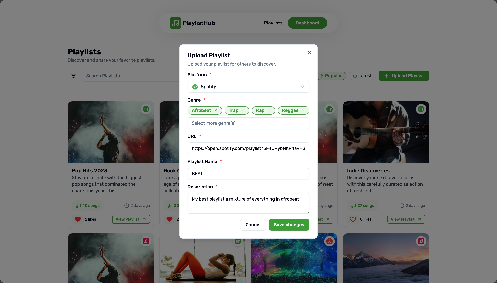
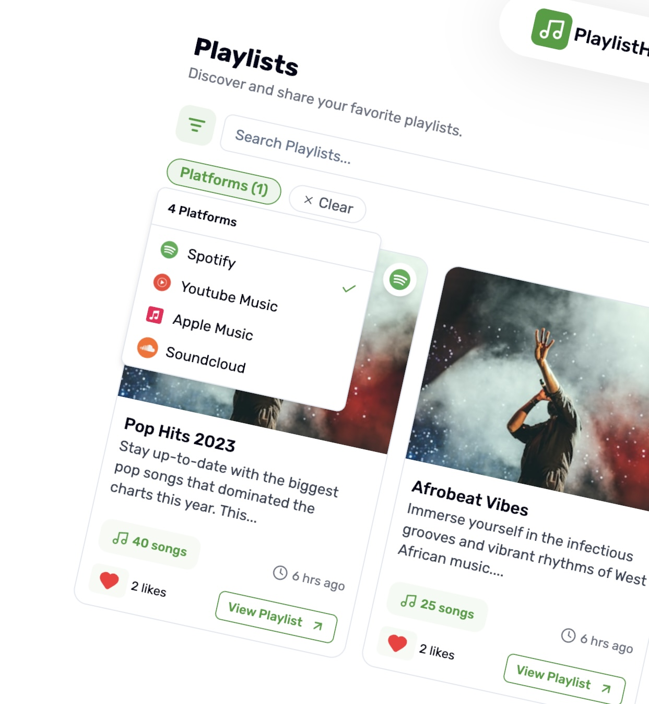
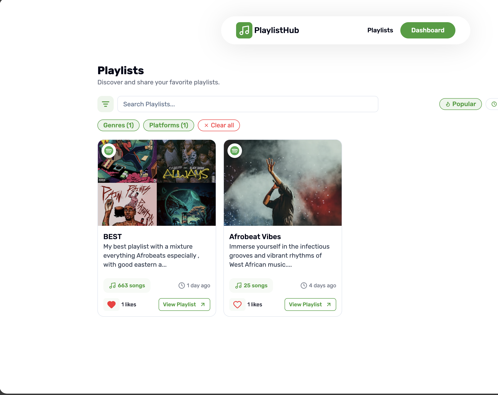

# PlaylistHub - Share and discover music playlists by others

PlaylistHub is a platform to discover music playlists by others and also share yours !
Built this for my fellow music lovers who might be interested in discovering what others are listening across platforms (Apple Music, Spotify and YouTube Music)

**Platforms Supported**

- ✅ YouTube Music
- ✅ Spotify
- ✅ Apple Music
- ❌ SoundCloud (not yet, soon)

**🛠️ Tech Stack**

- Sveltekit
- SQLite + Drizzle ORM
- Better-auth for auth
- Tanstack Query
- Nuqs for URL state management
- ShadCN UI + TailwindCSS

✨ **Nice Features**

- Search or filter by **genres** and **platform**
- Sort by **latest** or most **popular**
- Like your favorite playlist

👨‍💻 **Some Technical Features**

- Optimistic likes on the UI using Tanstack Mutation query, so liking a playlist is instant on the UI and in the case an error occurs all updates are rolled back with some nice toast messages !
- Complete auth protection for user specific API routes, user session is checked and if unauthorized then action won’t be done. Must be logged in to upload or like a playlist.
- Also composability in the code, good SOC practices and keeping the UI logic separate from the business logic

**PREVIEWS**

## Homepage

## Playlists View

## Upload Playlist

## Filter Options

## Active Filters

